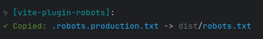
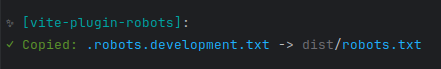

<div align="center">
  <a href="https://vitejs.dev/"></a>
  <h1>Vite Robots.txt</h1>

  <p>
    Plugin for <a href="https://vitejs.dev/">Vite</a> to generating robots.txt for production and development builds.
  </p>
  
  
  
  
  
  
  
  <a href="https://www.npmjs.com/package/vite-plugin-robots" target="_blank">
    </a>

  
</div>

<br/>

<a href="https://www.buymeacoffee.com/kolirt" target="_blank">
  
</a>

## Introduction

The package allows you to customize different `robots.txt` for `production` mode and `development` mode.

```bash
vite build
```


```bash
vite build --mode=development
```


## Installation

Use yarn or npm to install the package `vite-plugin-robots`.

```bash
npm install -D vite-plugin-robots

yarn add --dev vite-plugin-robots
```

## Setup

```ts
import { robots } from 'vite-plugin-robots'
import { defineConfig } from 'vite'

export default defineConfig({
  plugins: [
    robots({
      /* pass your config */
    })
  ]
})
```

## Configuration robot.txt

The package copies the corresponding robots.txt according to the build mode.

```
.robots.[mode].txt         # only loaded in specified mode
.robots.[mode].txt.local   # only loaded in specified mode, ignored by git
```

Create `.robots.production.txt` and `.robots.development.txt` in the project root and the package will start using them.

## License
[MIT](./LICENSE)
